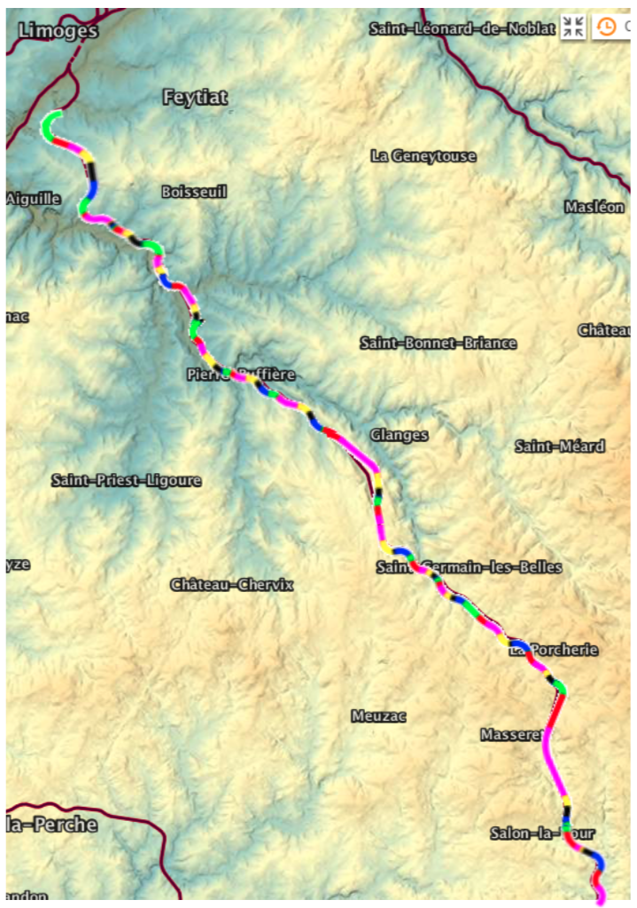
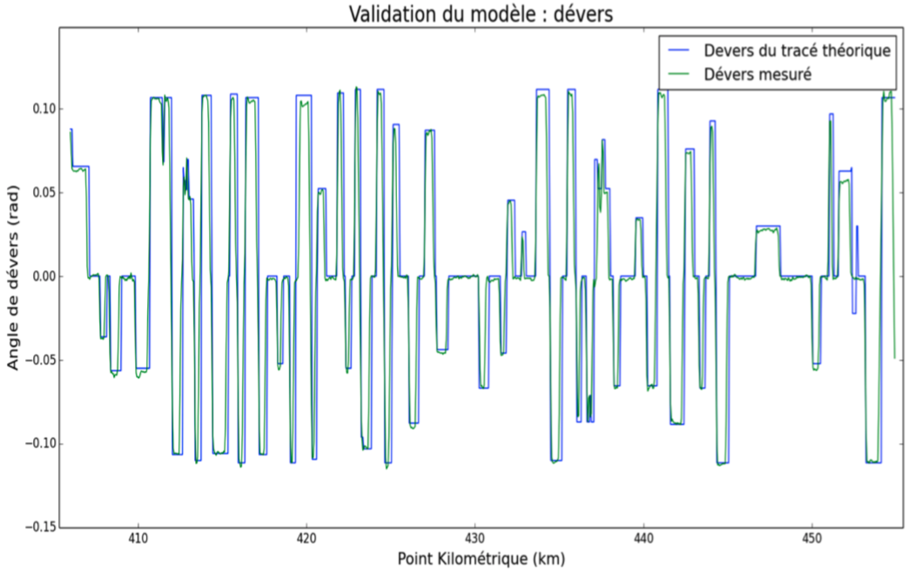
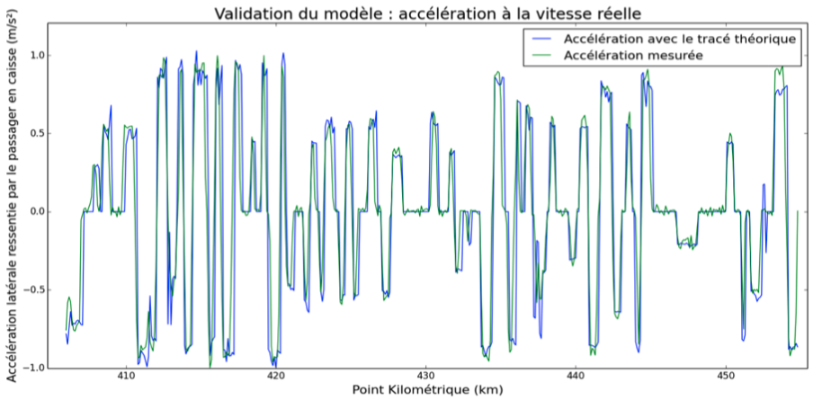
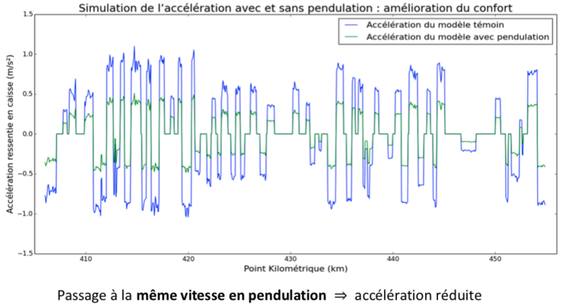
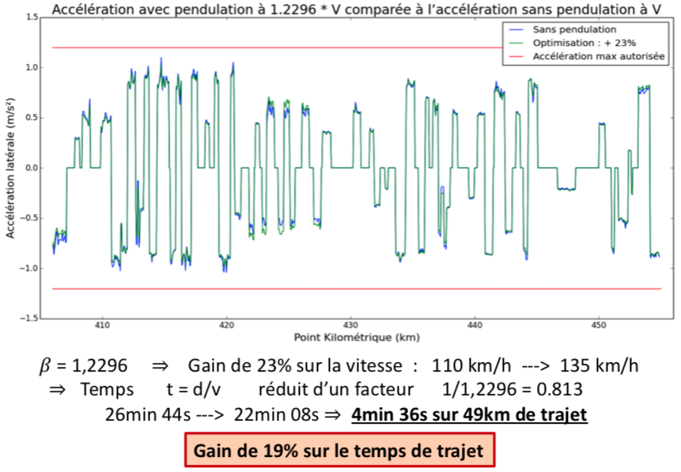

# Tilting Train Simulator
Simulator of a tilting train over a curve in Massif Central (France) based on data from the French railway company (SNCF). The goal was to compute the speed gain tilting the train could bring about. This project was part of my work for the Concours des Grandes Écoles and was my TIPE (Travail d'initiative personnelle encadré = Supervised self-initiated work).

# Validation of the simulator
## Railroad validation

## Cant deficiency validation

## Acceleration validation

# Simulation of tilting train
## Same speed comparison

## Same passenger acceleration (increased speed for tilting train)

